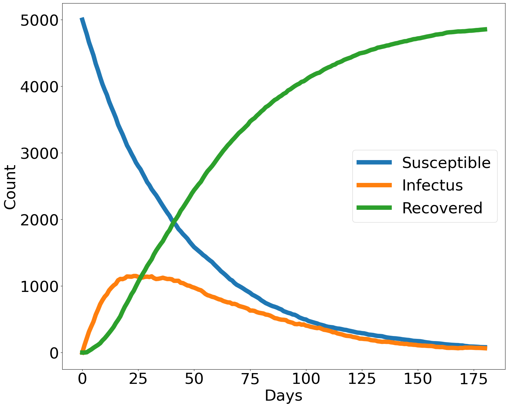

# SIR_model
[Susceptible Infectus Recovered](https://en.wikipedia.org/wiki/Compartmental_models_in_epidemiology) model implementation in swift

# Configuration
All the parameter are in the config struct
```swift
struct Config{
  static let beta = 150; //average number of contacts
  static let N = 5000; //population
  static let days = 180;
  static let SI = 0.9; //probability to infect
  static let gamma = Double(1)/20; //probability to recover
  static let R0 = Double(beta)/gamma;
  static let AppUsage = 0.1; //fraction of people with app
  static let MaskUsage = 0.3;

  static let birth_rate = 0.0001;
  static let death_rate = 0.00008;
}
```

# Plot


# License
See [LICENSE](LICENSE)
